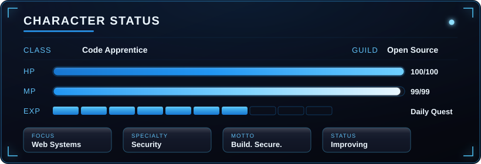
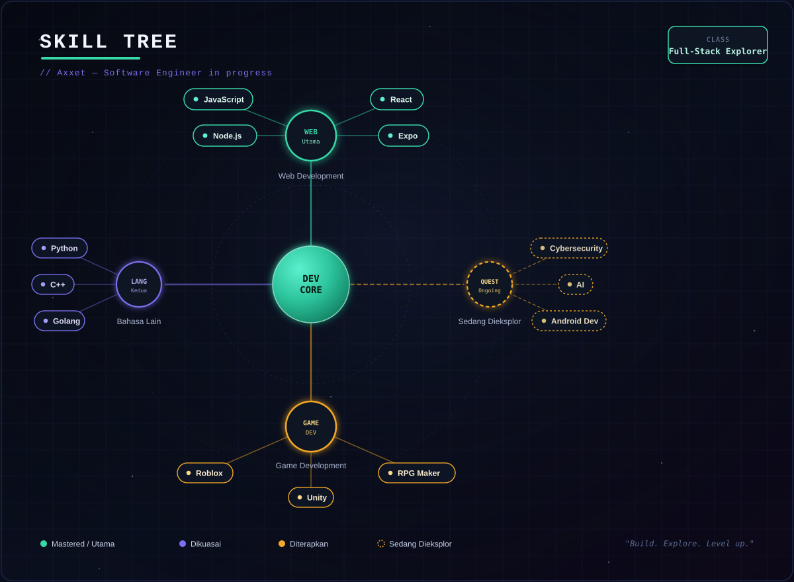

<!-- ================================================== -->
<!--  1. HEADER BANNER — uploaded cyber-blue banner       -->
<!-- ================================================== -->

  

<!-- ================================================== -->
<!--  2. TYPING SVG HEADER                                -->
<!-- ================================================== -->

 

 

<!-- ================================================== -->
<!--  3. CHARACTER STATUS — SVG HUD PANEL                 -->
<!-- ================================================== -->

  

 

<!-- ================================================== -->
<!--  4. SKILL TREE — SVG NODE GRAPH                      -->
<!-- ================================================== -->

  

 

<!-- ================================================== -->
<!--  5. RPG TROPHIES — 8-BIT ACHIEVEMENTS                -->
<!-- ================================================== -->

### 🏆 Trophies

 

<!-- ================================================== -->
<!--  6. STATS GRID — SIDE-BY-SIDE METRICS                -->
<!--  Kartu Stats & Top Languages di-generate sendiri     -->
<!--  lewat GitHub Actions (lihat .github/workflows/      -->
<!--  update-cards.yml) — bukan lagi memanggil server     -->
<!--  vercel.app pihak ketiga, jadi tidak akan kena 402    -->
<!--  atau rate limit lagi. SVG-nya ada di /profile/.      -->
<!-- ================================================== -->

### 📊 Stats

<table align="center" border="0" cellspacing="10" cellpadding="0">
<tr>
<td valign="top" width="50%">

</td>
<td valign="top" width="50%">

</td>
</tr>
</table>

⚙️ Kartu Stats & Top Languages di atas di-generate otomatis tiap hari lewat GitHub Actions (self-hosted, bukan server pihak ketiga) — lihat <code>.github/workflows/update-cards.yml</code>. Jalankan sekali secara manual dari tab Actions kalau <code>profile/stats.svg</code> belum muncul.

 

<!-- ================================================== -->
<!--  7. SNAKE CONTRIBUTION GRAPH                         -->
<!-- ================================================== -->

### 🐍 Contribution Grid

<picture>
  <source media="(prefers-color-scheme: dark)" srcset="https://raw.githubusercontent.com/Axxeto/Axxeto/output/github-contribution-grid-snake-dark.svg" />
  <source media="(prefers-color-scheme: light)" srcset="https://raw.githubusercontent.com/Axxeto/Axxeto/output/github-contribution-grid-snake.svg" />
  
</picture>

⚠️ Belum aktif? Jalankan workflow <code>snake.yml</code> sekali secara manual dari tab Actions.

 

<!-- ================================================== -->
<!--  8. FOOTER — SOCIAL BUTTONS                          -->
<!-- ================================================== -->

### 🔗 Connect

  

  
⚡ "Build. Secure. Improve." ⚡

