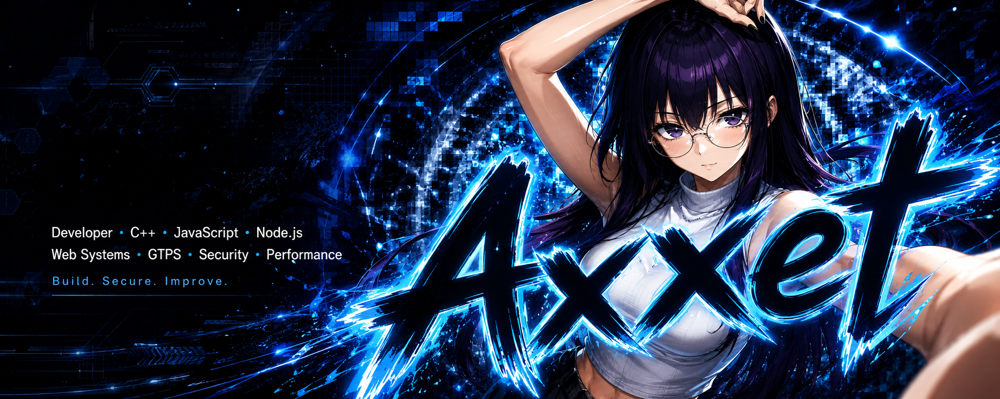

<!-- ================================================== -->
<!--  1. HEADER BANNER — PIXEL TEA ROOM (SVG, self-contained) -->
<!-- ================================================== -->

  

<!-- ================================================== -->
<!--  2. TYPING SVG HEADER                                -->
<!-- ================================================== -->

 

 

<!-- ================================================== -->
<!--  3. CHARACTER STATUS — RPG VISUAL STAT SHEET         -->
<!-- ================================================== -->

### 🍵 Character Status

<table align="center" width="80%" style="border-collapse: collapse; background-color:#23171B;">
<tr>
<td width="70%" valign="top">

|  |  |
|:---|:---|
| 🎭 **Class** | `Code Apprentice` |
| ❤️ **HP** | `██████████` 100/100 |
| 🍵 **MP (Tea/Coffee)** | `█████████▓` 99/99 |
| ⭐ **EXP** | `Daily Coding Quest` |
| 📍 **Guild** | `Open Source Tavern` |

</td>
<td width="30%" align="center" valign="middle">

</td>
</tr>
</table>

 

<!-- ================================================== -->
<!--  4. SKILL TREE — TECH STACK BADGES                   -->
<!-- ================================================== -->

### 🗡️ Skill Tree

**⚔️ Language**

**🛠️ Tools**

**📖 Currently Learning**

 

<!-- ================================================== -->
<!--  5. RPG TROPHIES — 8-BIT ACHIEVEMENTS                -->
<!-- ================================================== -->

### 🏆 RPG Trophies

 

<!-- ================================================== -->
<!--  6. STATS GRID — SIDE-BY-SIDE METRICS                -->
<!-- ================================================== -->

### 📊 Quest Log & Stats

<table align="center" border="0" cellspacing="10" cellpadding="0">
<tr>
<td valign="top" width="50%">

</td>
<td valign="top" width="50%">

</td>
</tr>
</table>

 

<!-- ================================================== -->
<!--  7. SNAKE CONTRIBUTION GRAPH                         -->
<!-- ================================================== -->

### 🐍 Daily Grind Log

<picture>
  <source media="(prefers-color-scheme: dark)" srcset="https://raw.githubusercontent.com/[USERNAME]/[USERNAME]/output/github-contribution-grid-snake-dark.svg" />
  <source media="(prefers-color-scheme: light)" srcset="https://raw.githubusercontent.com/[USERNAME]/[USERNAME]/output/github-contribution-grid-snake.svg" />
  
</picture>

⚠️ Belum aktif? Ikuti setup singkat "Cara Mengaktifkan Snake Graph" di bawah README.

 

<!-- ================================================== -->
<!--  8. FOOTER — SOCIAL BUTTONS                          -->
<!-- ================================================== -->

### 🍰 Join Me for Tea

  

  
🍵 "Setiap baris kode adalah seduhan teh yang lebih matang." 🍵

