<div align="center">

<!-- ================================================== -->
<!--  1. HEADER BANNER                                    -->
<!-- ================================================== -->
<p align="center">
  
</p>

<!-- ================================================== -->
<!--  2. TYPING SVG HEADER                                -->
<!--  readme-typing-svg (demolab) kadang telat/limit —    -->
<!--  fallback teks statis di bawahnya kalau gambar gagal -->
<!--  muat sama sekali (GitHub tidak render onerror pada   -->
<!--   markdown, jadi fallback ini teks biasa).       -->
<!-- ================================================== -->
<a href="#">
  
</a>

<sub>Kalau baris di atas kosong: <code>Hi, I'm Axxet — Aspiring Developer — Build. Secure. Improve.</code></sub>

<br/>


</div>

<br/>

<!-- ================================================== -->
<!--  3. CHARACTER STATUS — SVG HUD PANEL                 -->
<!--  File lokal, tidak berubah.                          -->
<!-- ================================================== -->
<p align="center">
  
</p>

<br/>

<!-- ================================================== -->
<!--  4. QUEST LOG — RINGKASAN SINGKAT                    -->
<!--  Bagian teks biasa, tidak bergantung pada layanan    -->
<!--  eksternal apa pun — selalu tampil.                  -->
<!-- ================================================== -->
<div align="center">

### 📜 Quest Log

</div>

```
┌─ CURRENT QUEST ─────────────────────────────────────────┐
│ Belajar & membangun proyek pribadi: web dev, game dev,   │
│ dan local AI tooling.                                    │
│                                                           │
│ Status   : Coding Newbie / Aspiring Developer            │
│ Level    : Newbie                                        │
│ Motto    : "Build. Secure. Improve."                     │
└───────────────────────────────────────────────────────────┘
```

<div align="center">
<sub>Masih level newbie, tapi quest log-nya jalan terus. Kalau ada yang mau nge-review kode atau ngobrol soal proyek, tinggal mampir lewat kontak di bawah.</sub>
</div>

<br/>

<!-- ================================================== -->
<!--  5. SKILL TREE — SVG NODE GRAPH                      -->
<!--  File lokal, tidak berubah.                          -->
<!-- ================================================== -->
<p align="center">
  
</p>

<br/>

<!-- ================================================== -->
<!--  6. TECH STACK — BADGE GRID (shields.io, stabil)     -->
<!--  shields.io adalah layanan badge paling tahan lama   -->
<!--  yang dipakai jutaan repo GitHub, jadi dipertahankan  -->
<!--  dan malah diperluas jadi grid per-kategori.          -->
<!-- ================================================== -->
<div align="center">

### 🌲 Skill Tree — Tech Stack

**Frontend**


**Game & Interactive**


**AI & Backend**


**Tools**


</div>

<br/>

<!-- ================================================== -->
<!--  7. ACTIVE QUESTS — PROYEK YANG SEDANG DIKERJAKAN     -->
<!--  Konten manual, tidak bergantung API pihak ketiga.    -->
<!--  Ganti isi tabel ini sesuai proyek yang lagi jalan.   -->
<!-- ================================================== -->
<div align="center">

### ⚔️ Active Quests

| Quest | Deskripsi | Status |
|---|---|---|
| 🌐 Web Development | Membangun proyek web dari nol, HTML/CSS/JS | 🟡 In Progress |
| 🎮 Game Development | Eksperimen RPG Maker & Roblox Studio | 🟡 In Progress |
| 🤖 Local AI Tooling | Eksplorasi model AI lokal & backend Python | 🟡 In Progress |

<sub>Papan quest ini di-update manual — bukan auto-fetch dari API mana pun, jadi selalu akurat sesuai yang terakhir ditulis di sini.</sub>

</div>

<br/>

<!-- ================================================== -->
<!--  7b. INVENTORY — LOADOUT SEHARI-HARI                 -->
<!--  Konten manual, tema RPG lanjutan dari Skill Tree —  -->
<!--  bedanya ini alat/lingkungan kerja, bukan bahasa/     -->
<!--  framework. Tidak bergantung API pihak ketiga.        -->
<!-- ================================================== -->
<div align="center">

### 🎒 Inventory

| Slot | Item | Catatan |
|---|---|---|
| 🗡️ Weapon | VS Code | Editor utama sehari-hari |
| 🛡️ Armor | Git + GitHub | Version control & backup proyek |
| 💍 Accessory | RPG Maker VX Ace / MV | Untuk eksperimen game dev |
| 📦 Consumable | Roblox Studio | Prototyping cepat dengan Lua |
| 🧪 Potion | Python | Eksperimen backend & AI tooling lokal |

<sub>Loadout ini bisa berubah kapan saja — namanya juga masih eksplorasi.</sub>

</div>

<br/>

<!-- ================================================== -->
<!--  7c. LEARNING LOG — EXP TRACKER                       -->
<!--  Konten manual, jujur dengan level "Newbie" yang       -->
<!--  sudah ditetapkan di Character Status. Update tabel    -->
<!--  ini kapan pun ada topik baru yang lagi dipelajari.    -->
<!-- ================================================== -->
<div align="center">

### 📖 Learning Log

| Topik | EXP Bar | Catatan |
|---|---|---|
| HTML/CSS/JS | ▓▓▓▓▓▓░░░░ | Dasar sudah oke, terus dipakai di proyek web |
| RPG Maker (VX Ace / MV) | ▓▓▓▓░░░░░░ | Event system & scripting dasar |
| Roblox Studio (Lua) | ▓▓▓░░░░░░░ | Masih tahap eksperimen kecil-kecilan |
| React Native | ▓▓░░░░░░░░ | Baru mulai eksplorasi |
| Python (AI backend) | ▓▓▓░░░░░░░ | Belajar sambil bikin local AI tooling |

<sub>Bar EXP di atas estimasi kasar, bukan angka pasti — intinya arah belajarnya ke mana.</sub>

</div>

<br/>

<!-- ================================================== -->
<!--  8. TROPHIES — 8-BIT ACHIEVEMENTS                    -->
<!--  github-profile-trophy (vercel.app) sering kena 402  -->
<!--  / rate-limit upstream GitHub API. Badge shields.io   -->
<!--  di bawah trophy sebagai fallback yang tidak akan     -->
<!--  pernah 402 karena tidak menghitung apa pun — cuma    -->
<!--  teks statis, jadi selalu tampil walau trophy gagal.  -->
<!-- ================================================== -->
<div align="center">

### 🏆 Trophies


<sub>⚠️ Kalau baris trophy di atas kosong/error, itu memang layanan pihak ketiga (vercel.app) sedang kena limit — bukan masalah di README ini. Statistik lengkap tetap bisa dilihat di bagian Stats di bawah, yang di-generate self-hosted lewat GitHub Actions dan tidak bergantung pada layanan tersebut.</sub>

</div>

<br/>

<!-- ================================================== -->
<!--  9. STATS GRID — SELF-HOSTED (GITHUB ACTIONS)        -->
<!--  Kartu Stats & Top Languages di-generate sendiri     -->
<!--  lewat GitHub Actions (lihat .github/workflows/      -->
<!--  update-cards.yml) — bukan memanggil server           -->
<!--  vercel.app pihak ketiga, jadi tidak akan kena 402     -->
<!--  atau rate limit lagi. SVG-nya disimpan di /profile/.  -->
<!-- ================================================== -->
<div align="center">

### 📊 Stats

<table align="center" border="0" cellspacing="10" cellpadding="0">
<tr>
<td valign="top" width="50%">

</td>
<td valign="top" width="50%">

</td>
</tr>
</table>


<sub>⚙️ Kartu Stats & Top Languages di atas di-generate otomatis tiap hari lewat GitHub Actions (self-hosted, bukan server pihak ketiga) — lihat <code>.github/workflows/update-cards.yml</code>. Jalankan sekali secara manual dari tab Actions kalau <code>profile/stats.svg</code> atau <code>profile/top-langs.svg</code> belum muncul. Kartu streak (demolab.com) di kanan masih pakai layanan eksternal karena logika streak lebih rumit untuk di-self-host; kalau suatu saat error, kartu stats.svg di kiri tetap jalan sendiri.</sub>

</div>

<br/>

<!-- ================================================== -->
<!-- 10. SNAKE CONTRIBUTION GRAPH                         -->
<!--  Self-hosted lewat GitHub Actions (snake.yml),       -->
<!--  bukan layanan pihak ketiga — cukup tahan lama        -->
<!--  selama repo & Actions masih aktif.                  -->
<!-- ================================================== -->
<div align="center">

### 🐍 Contribution Grid

<picture>
  <source media="(prefers-color-scheme: dark)" srcset="https://raw.githubusercontent.com/Axxeto/Axxeto/output/github-contribution-grid-snake-dark.svg" />
  <source media="(prefers-color-scheme: light)" srcset="https://raw.githubusercontent.com/Axxeto/Axxeto/output/github-contribution-grid-snake.svg" />
  
</picture>

<sub>⚠️ Belum aktif? Jalankan workflow <code>snake.yml</code> sekali secara manual dari tab Actions.</sub>

</div>

<br/>

<!-- ================================================== -->
<!-- 10b. BESTIARY OF BUGS — JURNAL BUG LUCU               -->
<!--  Konten manual bertema RPG, isi bebas diupdate kalau  -->
<!--  ada bug yang berkesan. Tidak bergantung API apa pun.  -->
<!-- ================================================== -->
<div align="center">

### 👾 Bestiary of Bugs

| Monster | Gejala | Cara Dikalahkan |
|---|---|---|
| 🐛 Off-by-One Slime | Loop selalu kelebihan/kekurangan satu | Cetak nilai index tiap iterasi, sabar |
| 👻 Ghost Import | Modul "ada" tapi error not found | Cek ulang path & virtual environment |
| 🦂 Async Scorpion | Kode jalan sebelum data siap | Pelajari ulang promise/await pelan-pelan |
| 🐍 Indentation Wyrm | Python ngambek soal spasi vs tab | Samakan editor config, jangan campur |

<sub>Bestiary ini bakal terus bertambah selama masih coding — semua musuh di atas pernah beneran dikalahkan, bukan cuma bercanda.</sub>

</div>

<br/>

<!-- ================================================== -->
<!-- 10c. GUILD PHILOSOPHY — CARA KERJA & KOLABORASI       -->
<!--  Teks manual, menjelaskan preferensi kerja/kolaborasi -->
<!--  dengan bahasa RPG yang konsisten dengan tema.         -->
<!-- ================================================== -->
<div align="center">

### 🏰 Guild Philosophy

</div>

```
┌─ GUILD RULES ───────────────────────────────────────────┐
│ 1. Ship kecil, ship sering — daripada nunggu "sempurna". │
│ 2. Baca error message sebelum panik.                     │
│ 3. Commit message jujur, bukan cuma "fix bug".           │
│ 4. Selalu ada ruang buat belajar hal baru.                │
└───────────────────────────────────────────────────────────┘
```

<div align="center">
<sub>Aturan di atas bukan dogma — cuma pengingat pribadi biar proyek nggak berantakan.</sub>
</div>

<br/>

<!-- ================================================== -->
<!-- 10d. SAVE POINTS — MILESTONE KECIL                    -->
<!--  Konten manual, checklist pencapaian personal.        -->
<!--  Bebas dicentang/ditambah kapan saja.                 -->
<!-- ================================================== -->
<div align="center">

### 💾 Save Points

- [x] Bikin proyek web pertama dari HTML/CSS/JS polos
- [x] Mulai eksperimen di RPG Maker (VX Ace & MV)
- [x] Coba-coba scripting Lua di Roblox Studio
- [ ] Rilis satu game kecil yang bisa dimainkan orang lain
- [ ] Punya local AI tooling yang bener-bener jalan stabil
- [ ] Publish proyek React Native pertama

<sub>Checklist ini save point, bukan deadline — dicentang kalau memang sudah tercapai.</sub>

</div>

<br/>

<!-- ================================================== -->
<!-- 10e. PARTY MEMBERS — KOLABORATOR / KOMUNITAS          -->
<!--  Placeholder, isi manual kalau ada kolaborator atau    -->
<!--  komunitas spesifik yang mau ditonjolkan. Kosongkan     -->
<!--  section ini kalau memang belum ada.                    -->
<!-- ================================================== -->
<div align="center">

### 🧑‍🤝‍🧑 Party Members

<sub>Slot ini buat nyebut kolaborator atau komunitas yang sering diajak diskusi/kerja bareng. Isi manual kalau sudah ada nama/link yang mau ditampilkan — dikosongkan dulu daripada mengisi nama sembarangan.</sub>

</div>

<br/>

<!-- ================================================== -->
<!-- 11. JOURNEY TIMELINE — PERJALANAN SINGKAT             -->
<!--  Konten teks manual, tidak butuh API sama sekali.     -->
<!-- ================================================== -->
<div align="center">

### 🗺️ Journey

</div>

```
  ○───────────○───────────○───────────○──────────▶ sekarang
  │           │           │           │
  Mulai       Web Dev     Game Dev    Local AI
  belajar     dasar       (RPG Maker  Tooling
  coding      (HTML/CSS/  & Roblox    (Python)
              JS)         Studio)
```

<div align="center">
<sub>Timeline ini sengaja simpel — bukan tanggal-tanggal presisi, cuma gambaran urutan area yang lagi/sudah dijelajahi.</sub>
</div>

<br/>

<!-- ================================================== -->
<!-- 11b. NPC DIALOGUE — FAQ SINGKAT                       -->
<!--  Teks manual, gaya dialog NPC RPG. Menjawab           -->
<!--  pertanyaan umum pengunjung profil.                   -->
<!-- ================================================== -->
<div align="center">

### 💬 NPC Dialogue

</div>

```
[Traveler]  "Kamu ngapain aja sih di sini?"
[Axxet]     "Belajar bikin website, bikin game kecil-kecilan
             pake RPG Maker & Roblox Studio, sama ngoprek
             AI yang jalan lokal di komputer sendiri."

[Traveler]  "Kenapa levelnya masih Newbie?"
[Axxet]     "Karena jujur aja masih belajar. Tapi progress-nya
             jalan terus, itu yang penting."

[Traveler]  "Boleh kolaborasi/ngobrol proyek?"
[Axxet]     "Boleh banget, tinggal chat lewat salah satu
             kontak di bagian Connect di bawah."
```

<br/>

<!-- ================================================== -->
<!-- 12. GITHUB ACTIONS SETUP NOTES                        -->
<!--  Dokumentasi ringkas di dalam README sendiri, biar    -->
<!--  gampang diingat cara maintain-nya tanpa buka file     -->
<!--  workflow tiap kali lupa.                              -->
<!-- ================================================== -->
<div align="center">

### ⚙️ Catatan Setup (untuk Axxet sendiri)

</div>

| Komponen | Sumber | Status |
|---|---|---|
| `profile/stats.svg`, `profile/top-langs.svg` | GitHub Actions (self-hosted) | ✅ Tidak bergantung layanan pihak ketiga |
| Snake contribution grid | GitHub Actions (`snake.yml`) | ✅ Tidak bergantung layanan pihak ketiga |
| Typing header | `readme-typing-svg.demolab.com` | ⚠️ Pihak ketiga — ada fallback teks di atas |
| Trophies | `github-profile-trophy.vercel.app` | ⚠️ Pihak ketiga — sering 402/limit |
| Streak stats | `streak-stats.demolab.com` | ⚠️ Pihak ketiga |
| Profile views counter | `komarev.com/ghpvc` | ⚠️ Pihak ketiga, tapi ringan & jarang down |
| Badge tech stack | `img.shields.io` | ✅ Sangat stabil, dipakai luas |

<div align="center">
<sub>Baris ⚠️ di atas bukan berarti harus buru-buru diganti — cukup tahu bagian mana yang bisa gagal duluan kalau README tiba-tiba terlihat aneh.</sub>
</div>

<br/>


<!-- ================================================== -->
<!-- 13. FOOTER — SOCIAL BUTTONS                           -->
<!-- ================================================== -->
<div align="center">

### 🔗 Connect


<br/><br/>


<br/><br/>
<sub>⚡ "Build. Secure. Improve." ⚡</sub>

</div>
